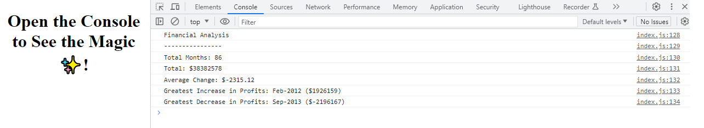

# Console-Finances
Analysis of financial records

## Features
This is a simple financial analysis script that calculates various financial months based on a provided dataset of monthly profits. It calculates the total net profit, average change in profits, and identifies the months with the greatest increase and decrease in profits.

## Usage

1. Open the link below on a web browser supporting dev tools. 
2. Head over to console tab in dev tools to find calculations in the terminal.

## Technologies used
Javascript

## How to Use
You can access the deployed version online: [View script in Website](https://b70b70.github.io/Console-Finances/)

This analysis effort was carried out by Faheem Ali.